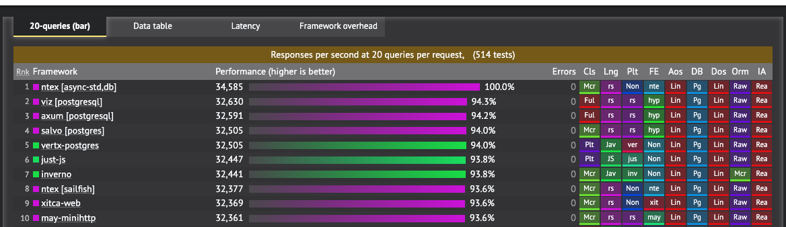
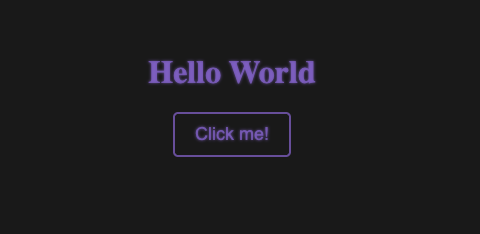
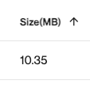
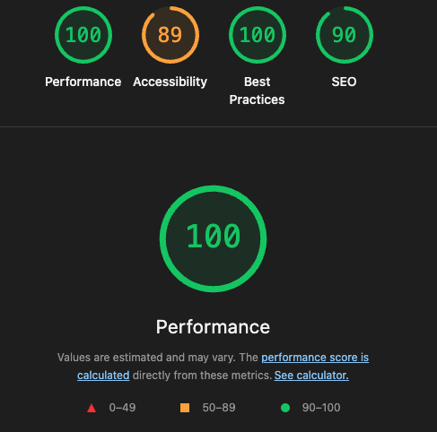

# Building the Fastest Website in the World*

<sub><sub><sub><sup>*At multiple queries in 2023</sup></sub></sub></sub>

The fastest website starts with the fastest backend


https://www.techempower.com/benchmarks/#section=data-r22&test=query

Ntex leads the way.

A website is just a rendered HTML page, however we value a little style here therefore our website will be made up of three files:

```html
<!DOCTYPE html>
<html>
    <head>
        <meta charset="UTF-8">
        <meta name="viewport" content="width=device-width, initial-scale=1.0">
        <title>My app</title>
        <link rel="stylesheet" href="styles.css">
        <script src="app.js"></script>
    </head>
    <body>
        <div>
            <h1>Hello World</h1>
            <button id="dynamic-button">Click me!</button>
            <div id="dynamic-content"></div>
        </div>
    </body>
</html>
```

```javascript
document.addEventListener("DOMContentLoaded", function() {
    document.getElementById("dynamic-button").addEventListener("click", function() {
        var contentDiv = document.getElementById("dynamic-content");

        if (contentDiv && contentDiv.innerHTML !== "") {
            contentDiv.remove();
        } else {
            if (!contentDiv) {
                contentDiv = document.createElement("div");
                contentDiv.id = "dynamic-content";
                document.body.appendChild(contentDiv);
            }

            fetch('/api/users')
                .then(response => response.json())
                .then(data => {
                    if (contentDiv) {
                        const userList = data.map(user =>
                            `<li>ID: ${user.id}, Name: ${user.name}, Age: ${user.age}</li>`
                        ).join('');
                        contentDiv.innerHTML = `<ul>${userList}</ul>`;
                    }
                })
                .catch(error => {
                console.error('Error fetching data:', error);
            });
        }
    });
});
```

```css
body {
    background-color: #1a1a1a;
    color: #ffffff;
    display: flex;
    flex-direction: column;
    justify-content: center;
    align-items: center;
    min-height: 80vh;
    margin: 0;
    text-align: center;
}

h1 {
    color: rgba(147, 112, 219, 0.7);
    text-shadow: 0 0 3px rgba(147, 112, 219, 0.7);
}

button {
    font-size: 18px;
    color: rgba(147, 112, 219, 0.7);
    text-shadow: 0 0 3px rgba(147, 112, 219, 0.7);
    background-color: #1a1a1a;
    border: 2px solid rgba(147, 112, 219, 0.7);
    padding: 10px 20px;
    border-radius: 5px;
}

#dynamic-content > * {
    font-size: 20px;
    color: rgba(147, 112, 219, 0.7);
    text-shadow: 0 0 3px rgba(147, 112, 219, 0.7);
}
```

Now with our beautiful frontend we can serve it with our fastest backend

```rust
use ntex::web;
use ntex_files as fs;

use serde::{Deserialize, Serialize};

// Define the return type and make it serializable (Json it)
#[derive(Serialize, Deserialize, Debug)]
struct User {
    id: i32,
    name: String,
    age: i32,
}

// Define the handler for the /api/users endpoint
async fn users() -> impl web::Responder {
    let user_list = vec![
        User {
            id: 1,
            name: "John Doe".to_string(),
            age: 25,
        },
        User {
            id: 2,
            name: "Jane Doe".to_string(),
            age: 30,
        },
    ];
    let serialised = serde_json::to_string(&user_list).unwrap();
    web::HttpResponse::Ok().body(serialised)
}

// Define our app and bind it to port 8050
// We also serve our static files from the dist directory
// dist is where we made our three files.
#[ntex::main]
async fn main() -> std::io::Result<()> {
    println!("Starting server at: http://{}:{}", "0.0.0.0", 8050);

    web::HttpServer::new(|| {
            web::App::new()
            .wrap(web::middleware::Logger::default())
            .route("/api/users", web::get().to(users))
            .service(fs::Files::new("/", "./dist/").index_file("index.html").show_files_listing())
        })
        .bind(("0.0.0.0", 8050))?
        .run()
        .await
}
```

By running with `cargo run` we can see our website at `http://localhost:8050/`



Why stop there? Lets get it on the platform so we can all enjoy it.

The fastest website deserves the smallest image size.

```dockerfile
FROM rust:alpine3.20 as build_backend # build layer

RUN apk add musl-dev gcc

COPY ./backend ./backend
WORKDIR /backend

RUN cargo build --release

FROM alpine:3.20 # run time layer

RUN apk update \
    && apk add openssl ca-certificates libc6-compat

ENV NIMBUS_USER_ID=112
RUN addgroup -S nimbus-group && adduser -S nimbus-user -G nimbus-group -u $NIMBUS_USER_ID
USER nimbus-user

# Only copy over the website and the executable to run the backend
COPY --chown=nimbus-user --from=build_backend ./backend/target/release/backend  ./app/backend
COPY --chown=nimbus-user --from=build_backend ./backend/dist ./app/dist

WORKDIR /app

EXPOSE 8050
CMD ["./backend"]
```

Which gives us a tidy little image size of 10.35MB



Did we do fast?



We did fast 😎
